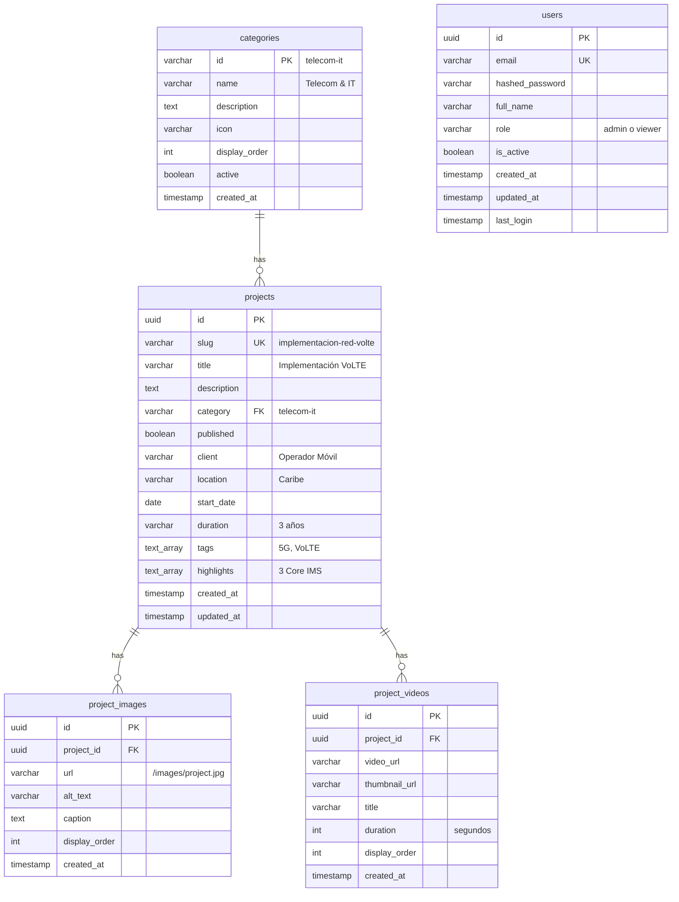

# 📊 Entity Relationship Diagram (ERD) - Sitecel v2

## Diagrama de Base de Datos



---

## 📋 Descripción de Tablas

### 1️⃣ **categories**
- **Propósito:** Categorías de proyectos (Telecom, Construcción, etc.)
- **Relaciones:** 1 categoría → N proyectos
- **Índices:** `id` (PK), `active`, `display_order`

### 2️⃣ **projects** (Tabla Principal)
- **Propósito:** Información completa de cada proyecto
- **Relaciones:** 
  - N proyectos → 1 categoría
  - 1 proyecto → N imágenes
  - 1 proyecto → N videos
- **Índices:** `id` (PK), `slug` (UK), `published`, `category`, `start_date`, `tags` (GIN)
- **Campos especiales:**
  - `tags[]`: Array PostgreSQL para búsquedas
  - `highlights[]`: Array de logros destacados
  - `duration`: String flexible ("3 años", "6 meses")

### 3️⃣ **project_images**
- **Propósito:** Galería de imágenes por proyecto
- **Relaciones:** N imágenes → 1 proyecto
- **Cascade:** ON DELETE CASCADE (si se borra proyecto, se borran imágenes)
- **Orden:** `display_order` define el orden de visualización

### 4️⃣ **project_videos**
- **Propósito:** Videos embebidos o locales
- **Relaciones:** N videos → 1 proyecto
- **Cascade:** ON DELETE CASCADE
- **Soporta:** URLs locales o YouTube/Vimeo

### 5️⃣ **users**
- **Propósito:** Usuarios del sistema admin (Fase 1)
- **Roles:** `admin` (full CRUD), `viewer` (solo lectura)
- **Seguridad:** Password con bcrypt

---

## 🔗 Relaciones Clave

### Proyecto Completo:
```
projects
├── category (1:N con categories)
├── images[] (1:N con project_images)
└── videos[] (1:N con project_videos)
```

### Ejemplo de Query:
```sql
-- Obtener proyecto completo con todas sus relaciones
SELECT 
    p.*,
    c.name as category_name,
    array_agg(DISTINCT pi.url) as image_urls,
    array_agg(DISTINCT pv.video_url) as video_urls
FROM projects p
JOIN categories c ON p.category = c.id
LEFT JOIN project_images pi ON p.id = pi.project_id
LEFT JOIN project_videos pv ON p.id = pv.project_id
WHERE p.slug = 'implementacion-red-volte-vowifi'
GROUP BY p.id, c.name;
```

---

## 📊 Estadísticas del Schema

| Elemento | Cantidad |
|----------|----------|
| Tablas | 5 |
| Vistas | 2 |
| Índices | 16 |
| Funciones | 3 |
| Triggers | 2 |
| Foreign Keys | 4 |

---

## 🎯 Decisiones de Diseño (ADRs)

### 1. **UUID vs. INT para IDs**
- **Decisión:** UUID
- **Razón:** Mejor para APIs distribuidas, no predecibles, compatibles con replicación
- **Trade-off:** Más espacio (16 bytes vs 4), pero más seguridad

### 2. **Slug como campo separado**
- **Decisión:** Campo `slug` separado del `id`
- **Razón:** URLs amigables, SEO, independiente del ID interno
- **Ejemplo:** `/proyectos/volte-caribe` en lugar de `/proyectos/123e4567-e89b`

### 3. **Arrays nativos de PostgreSQL**
- **Decisión:** `tags[]` y `highlights[]` como ARRAY(TEXT)
- **Razón:** Evita tabla intermedia para listas simples, búsquedas con GIN index
- **Alternativa rechazada:** Tablas `project_tags` separadas (overhead innecesario)

### 4. **Duration como VARCHAR**
- **Decisión:** VARCHAR(50) en lugar de INTEGER (días)
- **Razón:** Flexibilidad ("3 años", "6 meses", "45 días"), mejor UX
- **Trade-off:** No ordenable numéricamente, pero no es requisito

### 5. **Soft Delete vs. Hard Delete**
- **Decisión:** Hard delete (CASCADE)
- **Razón:** GDPR compliance, simplicidad, no necesitamos auditoría histórica aún
- **Futuro:** Si se requiere auditoría, agregar `deleted_at` field

---

## 🔄 Migraciones Futuras (Roadmap)

### Fase 2 (Chatbot):
```sql
-- Agregar embeddings para búsqueda semántica
ALTER TABLE projects ADD COLUMN embedding vector(1536);
CREATE INDEX ON projects USING ivfflat (embedding vector_cosine_ops);
```

### Fase 3 (Optimización):
```sql
-- Agregar full-text search
ALTER TABLE projects ADD COLUMN search_vector tsvector;
CREATE INDEX ON projects USING GIN(search_vector);
```

---

## 📚 Referencias

- [PostgreSQL Array Types](https://www.postgresql.org/docs/current/arrays.html)
- [UUID in PostgreSQL](https://www.postgresql.org/docs/current/datatype-uuid.html)
- [Triggers](https://www.postgresql.org/docs/current/sql-createtrigger.html)

---

**Última actualización:** 2025-12-17  
**Versión:** 1.0  
**Owner:** Pedro Araujo (@paraujoq)
